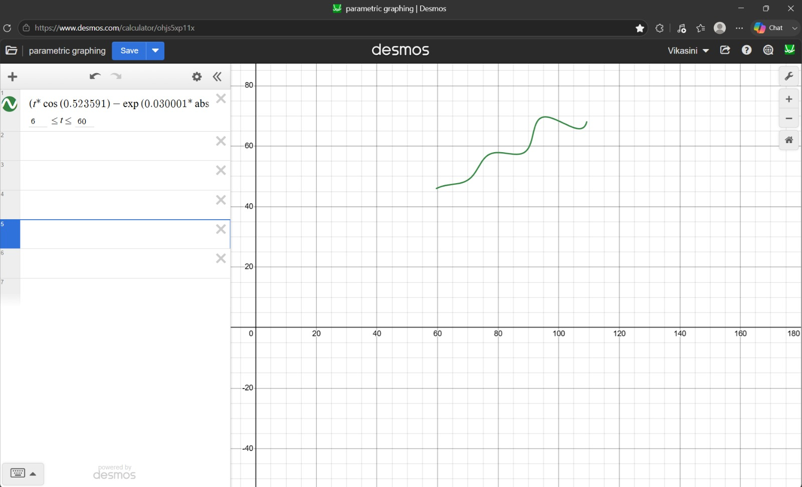

# FlamApp AI – Research & Development Assignment

## Candidate Information

- **Name:** Vikasini S
- **Course:** B.Tech Computer Science and Engineering (Artificial Intelligence)
- **College:** Amrita Vishwa Vidyapeetham

---

# Problem Statement

The objective of this assignment is to estimate the unknown parameters of a parametric curve using a dataset consisting of 1500 two-dimensional points.

The given parametric equations are:

\[
x(t)=t\cos(\theta)-e^{M|t|}\sin(0.3t)\sin(\theta)+X
\]

\[
y(t)=42+t\sin(\theta)+e^{M|t|}\sin(0.3t)\cos(\theta)
\]

Unknown parameters:

- θ (Rotation Angle)
- M (Exponential Growth Factor)
- X (Horizontal Translation)

Parameter constraints:

| Parameter | Range |
|-----------|-------|
| θ | 0° – 50° |
| M | -0.05 – 0.05 |
| X | 0 – 100 |
| t | 6 – 60 |

The objective is to estimate θ, M and X such that the generated curve closely matches the provided dataset while minimizing the L1 distance.

---

# Repository Structure
```
│
├── data/
│   └── dataset.csv
│
├── outputs/
│   ├── input_curve.png
│   ├── final_curve_fit.png
│   ├── output.jpeg
│   ├── final_parameters.txt
│   └── final_summary.csv
│
├── src/
│   └── main.ipynb
│
├── .gitignore
├── README.md
└── requirements.txt
```
---

# Solution Workflow

```
Input Dataset
      │
      ▼
Load CSV using Pandas
      │
      ▼
Exploratory Data Analysis
      │
      ▼
Visualize Dataset
      │
      ▼
Implement Parametric Equation
      │
      ▼
Generate Uniform t Samples
      │
      ▼
Generate Initial Curve
      │
      ▼
Check Dataset Ordering
      │
      ▼
Nearest-Neighbour Matching (KDTree)
      │
      ▼
L1 Distance Calculation
      │
      ▼
Differential Evolution Optimization
      │
      ▼
Estimate θ, M and X
      │
      ▼
Validate Results
      │
      ▼
Generate Final Outputs
```

---

# Methodology

## Step 1 – Data Loading

The provided CSV dataset containing 1500 two-dimensional points was loaded using Pandas.

Basic exploratory analysis included:

- Dataset dimensions
- Missing value inspection
- Data types
- Statistical summary

---

## Step 2 – Data Visualization

The input dataset was visualized using a scatter plot to understand the overall shape of the curve before beginning parameter estimation.

---

## Step 3 – Parametric Curve Implementation

The given mathematical equations were implemented directly in Python.

Uniform values of parameter **t** were generated over the interval:

```
6 ≤ t ≤ 60
```

using NumPy.

An initial curve was generated using trial parameter values to verify that the mathematical implementation was correct.

---

## Step 4 – Dataset Ordering Verification

A color-coded visualization of the dataset was created using point indices.

Observation:

The points were not ordered according to parameter **t**.

Because of this, directly comparing point *i* of the generated curve with point *i* of the dataset would produce incorrect error values.

---

## Step 5 – Curve Matching and Error Computation

Since the observed points are not ordered according to the parameter **t**, direct point-to-point comparison would produce incorrect error values.

To compare the generated curve with the observed dataset, a nearest-neighbour search using **SciPy KDTree** was performed. Each observed point was matched with its closest generated point.

The optimization objective was defined as the mean **L1 (Manhattan) distance** between all matched point pairs.

----

## Step 6 – Parameter Optimization

The unknown parameters were estimated using Differential Evolution.

Reasons for choosing Differential Evolution:

- Nonlinear objective function
- Bounded search space
- Small number of unknown parameters
- Robust global optimization without requiring gradients

Optimization bounds:

| Parameter | Bounds |
|-----------|--------|
| θ | 0 – 50 |
| M | -0.05 – 0.05 |
| X | 0 – 100 |

---

# Validation

Several validation experiments were performed to verify the reliability of the estimated parameters.

---

## 1. Visual Validation

The optimized curve almost perfectly overlaps the observed dataset.

This indicates that the estimated parameters successfully reproduce the original curve.

---

## 2. Multiple Random Seeds

The optimization was repeated using multiple random seeds.

| Seed | θ | M | X |
|------|------|------|------|
| 1 | 29.999346 | 0.030001 | 54.998401 |
| 7 | 29.999498 | 0.030001 | 54.998907 |
| 21 | 29.999936 | 0.030001 | 54.999542 |
| 42 | 29.999565 | 0.030001 | 54.998962 |
| 99 | 29.999630 | 0.030001 | 54.998723 |

Observation:

All optimization runs converged to nearly identical parameter values, indicating that the solution is stable and reproducible.

---

## 3. Sensitivity Analysis

Each parameter was varied independently while keeping the remaining parameters fixed.

The L1 error achieved its minimum near:

- θ ≈ 30°
- M ≈ 0.03
- X ≈ 55

This indicates that the recovered parameters correspond to a local optimum in the objective function.

---

## 4. Residual Analysis

Residual statistics:

| Metric | Value |
|---------|-------|
| Mean Residual | 0.01336226 |
| Median Residual | 0.01299859 |
| Minimum Residual | 0.00015527 |
| Maximum Residual | 0.04044197 |
| Standard Deviation | 0.00812331 |

Observation:

Residuals remain consistently small across the dataset, indicating a high-quality fit.

---

## 5. Optimization Convergence

Optimization statistics:

| Metric | Value |
|---------|-------|
| Execution Time | 3.14 seconds |
| Iterations | 34 |
| Function Evaluations | 2152 |

The convergence plots show a rapid reduction in the objective value during the initial iterations, followed by gradual refinement and convergence to a stable minimum.

---

# Final Estimated Parameters

| Parameter | Estimated Value |
|-----------|----------------:|
| θ (degrees) | 29.999565 |
| θ (radians) | 0.523591 |
| M | 0.030001 |
| X | 54.998962 |

---

# Final L1 Error

```
0.01336226
```

---

# Final Parametric Equation

$$
\left(
t\cos(0.523591)
-
e^{0.030001|t|}
\sin(0.3t)\sin(0.523591)
+
54.998962,\;
42+t\sin(0.523591)
+
e^{0.030001|t|}
\sin(0.3t)\cos(0.523591)
\right)
$$

$$
6 \le t \le 60
$$

## Optimization Convergence (Zoomed)



# Technologies Used

- Python
- NumPy
- Pandas
- Matplotlib
- SciPy

---

# References

### Assignment

FlamApp AI. (2026).

*Research & Development Assignment – Parametric Curve Parameter Estimation.*

Internal assignment document and dataset provided by FlamApp AI.

---

### Optimization Algorithm

Storn, R., & Price, K. (1997).

*Differential Evolution – A Simple and Efficient Heuristic for Global Optimization over Continuous Spaces.*

Journal of Global Optimization, **11**(4), 341–359.

https://doi.org/10.1023/A:1008202821328

---

### Differential Evolution Documentation

SciPy Community. (2025).

*scipy.optimize.differential_evolution.*

SciPy Documentation.

https://docs.scipy.org/doc/scipy/reference/generated/scipy.optimize.differential_evolution.html

---

### KDTree Documentation

SciPy Community. (2025).

*scipy.spatial.cKDTree.*

SciPy Documentation.

https://docs.scipy.org/doc/scipy/reference/generated/scipy.spatial.cKDTree.html

---
### Distance Metric

Deza, M. M., & Deza, E. (2009).

*Encyclopedia of Distances.*

Springer.

https://doi.org/10.1007/978-3-642-00234-2

---

### Desmos Equation Formatting

Desmos Studio PBC. (n.d.).

*Desmos Graphing Calculator.*

https://www.desmos.com/calculator/rfj91yrxob

---

# Conclusion

A robust optimization-based approach was developed to estimate the unknown parameters of the given parametric curve.

The final solution achieved:

- Stable convergence across multiple optimization runs
- Low mean L1 error (0.01336226)
- Consistent residual distribution
- Accurate reconstruction of the original curve

The validation experiments demonstrate that the estimated parameters reliably reproduce the provided dataset while satisfying the assignment constraints.

# Academic Integrity

Working on this assignment was completed independently and good experience. All the rules mentioned was followed up sincerely.
